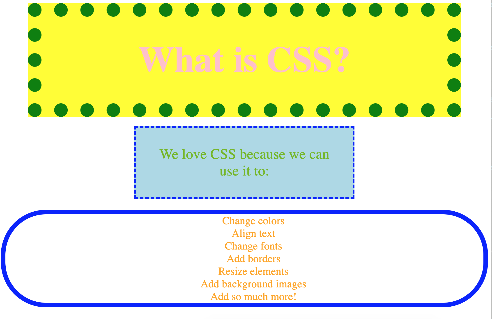

# Intro to CSS

##### Let's add some styles to the paragraph `<p>` tag. You'll need to add a new block to your CSS file with the `p` selector!
    ```
      p {

      }
    ```
  - Change the `color` to one of your favorite colors! *Hint* instead of using a named color you could use a [hex color](https://www.google.com/search?q=hex+color+picker&oq=hex+colo&aqs=chrome.0.0l2j69i57j0l2j69i60.1591j0j4&sourceid=chrome&ie=UTF-8). For Example:
      ```
      p {
        color: #72b811;
      }
      ```
  - Increase the `font-size`.
  - Put a dashed blue border around the `<p>`.
  - Set a width.
  - Add a background color.
  - Center the text within the box
  - Add more space between the words and border line (*Hint* we did this for the `<h1>`)
  - Center the box on the page

##### Now let's style the `<ul>`
  - Make the `<ul>` element similar to this:
    
  - Here are the properties you will need! If you are not sure how to use any of them don't hesitate "`__property__name___` CSS" (For example: "border CSS")
      - `border`
      - `color`
      - `text-align`
      - `font-size`
      - `border-radius`
      - `list-style`


